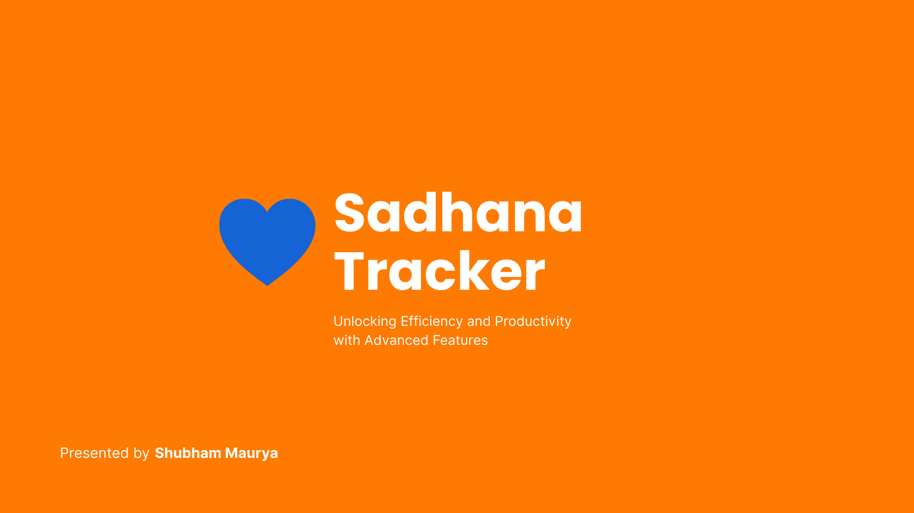
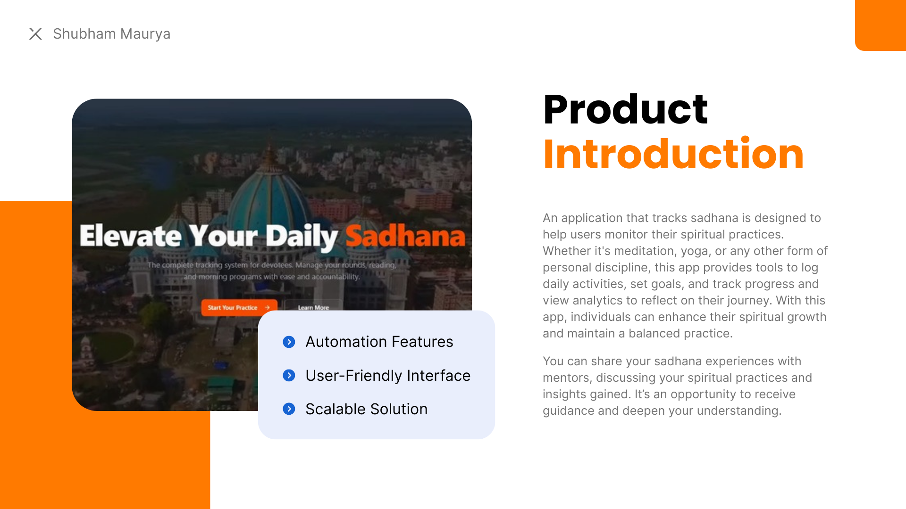
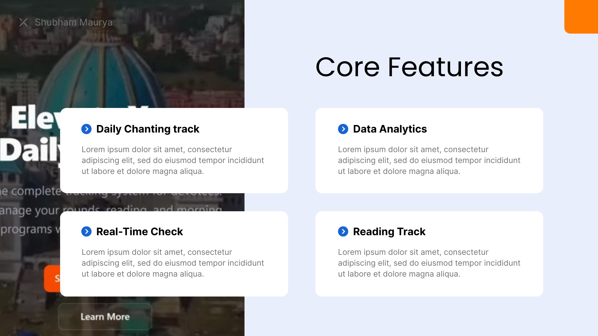
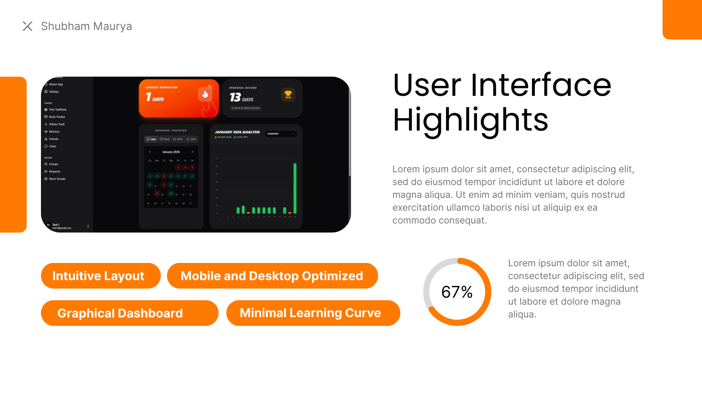
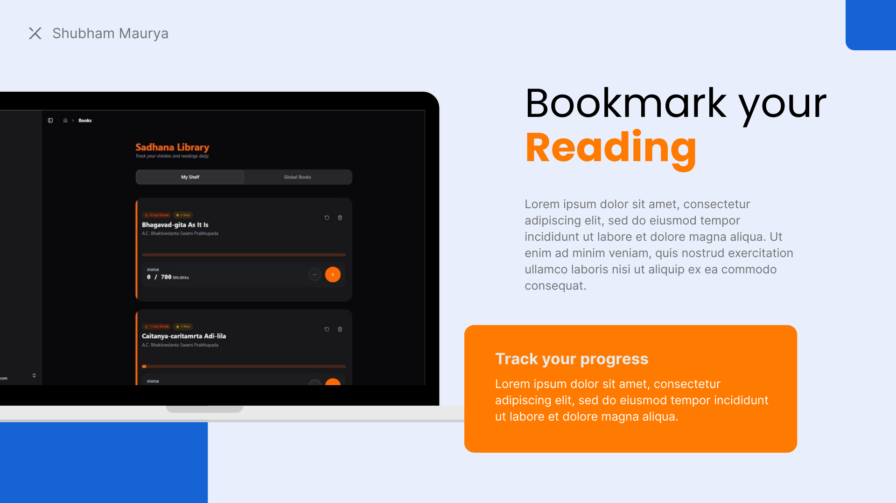
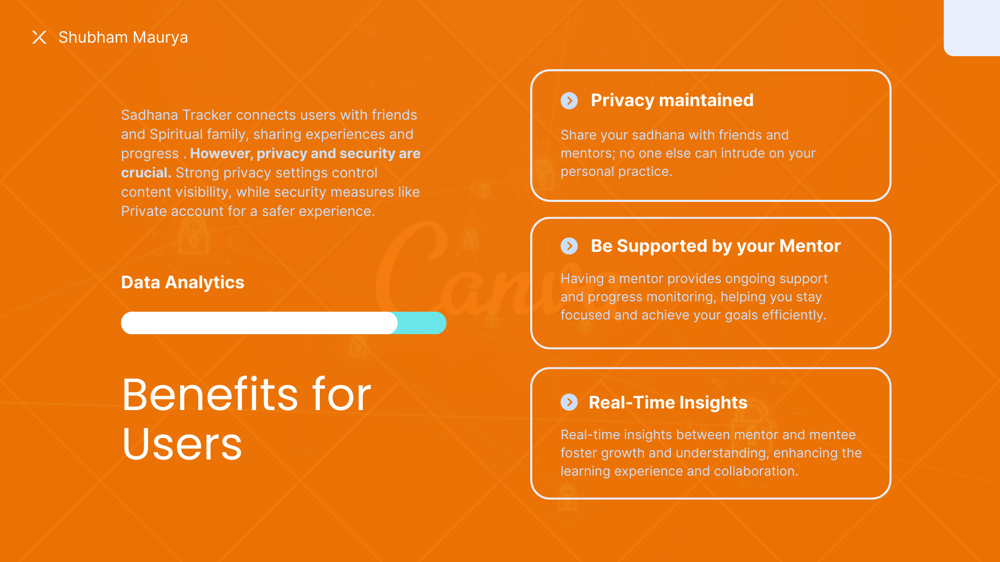
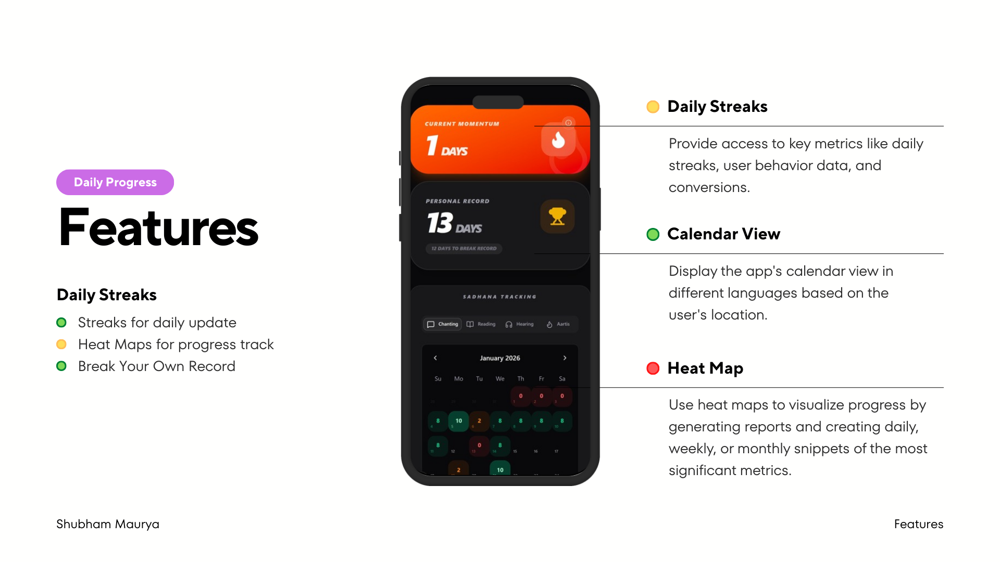
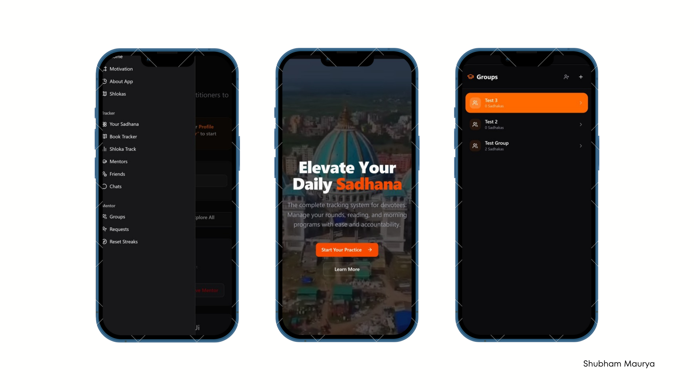
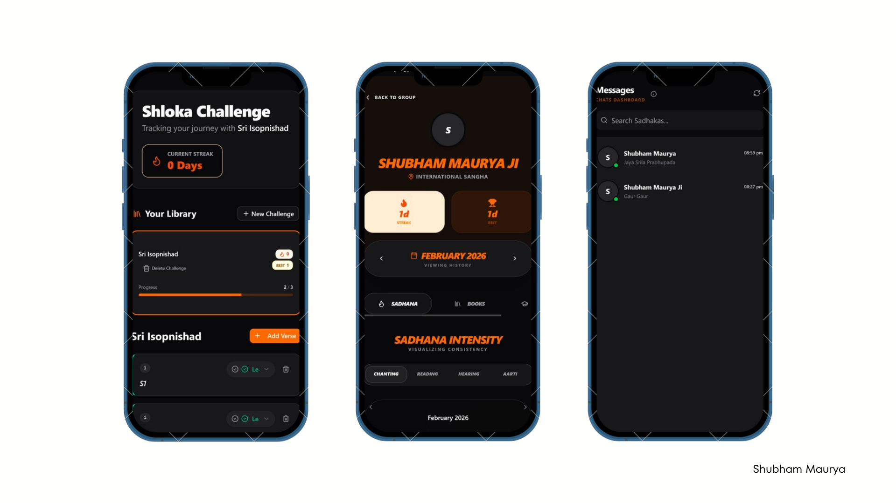

# 🚀 Sadhana Tracker
**Solving Consistency & Accountability Challenges in Daily Practice**

Sadhana Tracker is designed for individuals who struggle with inconsistency, lack of tracking, and a lack of structured guidance in their spiritual or personal disciplines. It transforms unstructured effort into a measurable, guided journey.

---

## ❗ Problems Addressed
* **Inconsistency:** Difficulty maintaining a daily routine without reminders or structure.
* **Zero Visibility:** No clear way to see progress or long-term improvement.
* **Manual Friction:** Tracking that is inaccurate, tedious, or easily forgotten.
* **Isolation:** A lack of accountability and access to mentor guidance.
* **Privacy:** Concerns regarding the security of personal spiritual data.

## ✅ The Solution
Sadhana Tracker provides a robust suite of tools to bridge the gap between intention and action:

* 📖 **Reading Tracker:** Integrated bookmarking system for spiritual texts.
* 🧘 **Chanting Tracker:** Real-time check-ins for daily meditation/mantra practice.
* 📊 **Deep Analytics:** Visual dashboards, detailed reports, and GitHub-style heat maps.
* 🔥 **Consistency Hooks:** Daily streaks and personal record tracking to keep motivation high.
* 🗓️ **Localized Calendar:** A view tailored to specific dates and observances.
* 👥 **Mentorship Ecosystem:** Search, add, follow mentors, or provide guidance to others.
* 📡 **Real-time Insights:** Instant feedback loops between mentors and mentees.
* 🔒 **Privacy First:** Fine-grained controls; your data is visible only to chosen friends and mentors.
* 📱 **Modern UI:** Fully responsive experience built with `shadcn/ui`.

---

## 📸 App Walkthrough

<table style="width: 100%;">
  <tr>
    <td width="33%"></td>
    <td width="33%"></td>
    <td width="33%"></td>
  </tr>
  <tr>
    <td width="33%"></td>
    <td width="33%"></td>
    <td width="33%"></td>
  </tr>
  <tr>
    <td width="33%"></td>
    <td width="33%"></td>
    <td width="33%"></td>
  </tr>
  <tr>
    <td width="33%"></td>
    <td width="33%"></td>
    <td width="33%"></td>
  </tr>
</table>

---

## 🛠️ Tech Stack
- **Framework:** [Next.js](https://nextjs.org/)
- **Database:** [SQL](https://en.wikipedia.org/wiki/SQL)
- **Styling/Components:** [shadcn/ui](https://ui.shadcn.com/) & Tailwind CSS

## 🎯 Impact
By combining **Product Thinking** with **Spiritual Tech**, this application helps users stay focused, motivated, and aligned with their higher goals. It moves the needle from "occasional practice" to "disciplined lifestyle."

---

#ProblemSolving #ProductThinking #NextJS #SQL #shadcn #SpiritualTech #Analytics #UXUI #Mentorship #Application
